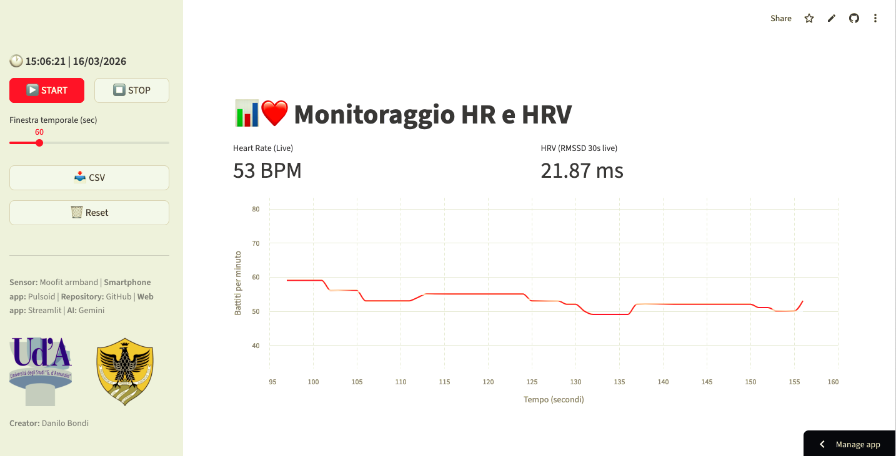

# 📊 HR and HRV Monitoring for Educational Purposes 💓

This web application enables real-time monitoring of **Heart Rate (HR)** and **Heart Rate Variability (HRV)** using data from **Moofit** sensors via the **Pulsoid** ecosystem and a customized **Streamlit** web app.

---

## 🚀 Key Features

- **Real-time Streaming**: Direct connection to the Pulsoid API for high-frequency HR data.
- **Exemplary HRV Analysis**: 
  - Calculation of the **RMSSD** metric (Root Mean Square of Successive Differences).
  - **30-second sliding window** for live monitoring.
  - Global reporting (Average BPM and total RMSSD) provided upon session completion.
- **Session Summary**: Automated display of Average BPM and total RMSSD once **STOP** is pressed.
- **Interactive Graphics**: Dynamic visualization with trend lines powered by the *Altair* library.
- **Data Export**: Instant download of the session in `.csv` format for further analysis.
- **Relative Time Scale**: The graph displays elapsed time from the start of the recording.

---

## 📸 Example Screenshot

Below is an example of the app interface during an active recording, after the initial 30-second waiting period.

---

## 🛠️ Technical Requirements

The app is developed in **Python** and requires the following libraries:
* `streamlit`, `pandas`, `numpy`, `altair`, `streamlit-autorefresh`, `pytz`.

---

## 📖 Getting Started

1. **Pulsoid Configuration**: Connect your Moofit sensor to the Pulsoid app and obtain your **Access Token**.
2. **App Setup**: Insert your token into `app.py` (Line 12).
3. **Usage**: Click **START** to record. Live RMSSD appears after 30s. Click **STOP** to summarize and download.

---

## 🔬 Disclaimer

### Data Validity
Neither the sensor nor the data acquisition method allow these values to be used for clinical or research purposes. This web app was created for **educational purposes only**!

---

## 🎓 Credits
**Developed by:** Danilo Bondi
**Release Date:** March 16, 2026

**Institutional Affiliations:**
* University "G. d'Annunzio" of Chieti-Pescara (UDA)
* University of L'Aquila (UnivAq)

**AI Support:** Designed with the assistance of Gemini (Google AI).
